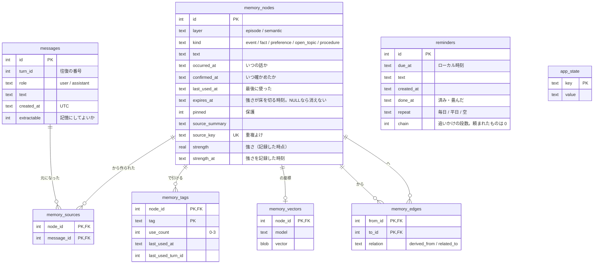

# 06 データベース

SQLite 1ファイル（既定 `data/kotoha.sqlite3`）。外部キーは有効、ロック待ちは5秒。

## ER図

`reminders`、`diary`、`habits`、`app_state` は、ほかの表と繋がりません。

## 項目の決まり

### messages

- `UNIQUE(turn_id, role)` ── **ひとつの往復に、発言と返事はひとつずつ。** 生成に失敗した往復は「発言だけ」の状態で残り、同じ発言を送り直すと空いている返事の枠に入ります
- `turn_id` は**書き込みと同じ1文の中で採ります**。読んでから書くと、そのあいだに別の書き手が入って同じ番号になります（実際に起きました）
- `extractable=0` は「画面には残すが、長期記憶には昇格させない」。朝の天気やゴミがこれです

### memory_nodes

- 層と種類の組み合わせは CHECK で縛ります（episode なら event、semantic ならそれ以外）
- `source_key` が UNIQUE なので、同じ内容は二度入りません
- `strength` は記録時点の強さで、いまの強さは `strength_at` からの経過で薄れます（`memory/strength.py`）。`expires_at` はそこから導いた「床を切る時刻」で、忘却はこれを見ます。思い出すと強さが足され、`expires_at` も引き直されます
- `strength` / `strength_at` は `MIGRATIONS` の版2で足しました。足した日に、既存の記憶には残り日数から逆算した強さを入れます（期限は変わらない）
- `pinned=1` は消えず、毎回のプロンプトに載ります

### memory_tags

- `use_count` は 0〜3 で頭打ち。よく当たるタグから先に候補にします
- 使われないまま `TAG_RESET_DAYS` が過ぎると 0 に戻ります（**古い記憶が居座り続けないため**）

### reminders

- `due_at` だけ**ローカル時刻**（`YYYY-MM-DD HH:MM`）。「明日の9時」を読み替えるのがモデルの側なので、そこにUTCを混ぜると間違いのもとになります
- `done_at` は「言った」「取り消した」「古すぎて畳んだ」のいずれでも入ります。`repeat` があれば、そのとき次の日のぶんを1行入れ直します
- `chain` が 1 以上の行は、ことはが自分で入れた「もう一度言う」。返事（会話・「あとで」）が来たら消えます。上限は `remind.CHAIN_LIMIT`
- `repeat` と `chain` は `MIGRATIONS` の版1で足しました（`ALTER TABLE`）。`SCHEMA` 側には書きません。書くと、新しいDBで同じ列を二度足そうとします

### diary

- `day` は**ローカルの日付**（`YYYY-MM-DD`）で、1日1件（UNIQUE）。会話は `messages.created_at`（UTC）をローカルの0時で切って集めます
- `text` はことはが書いた本文。話さなかった日は `diary.SILENT` の定型
- 消したり直したりする口は今のところありません

### habits

- 日記から週に一度固める「相手の習慣」。`retired_at` が入ったものは薄れた習慣で、消さないが会話には出しません
- 振り返りで同じ習慣が挙がれば `text` を書き換えて `confirmed_at` を進めます。id は変わりません

### app_state

キーと値だけの物置です。**キーの定義は `memory/db.py` にだけ**置きます。

| キー                                                              | 中身                            |
| --------------------------------------------------------------- | ----------------------------- |
| `last_conversation_at` / `last_notify_at`                       | 最後に話した／鳴らした時刻                 |
| `last_backup_at` / `last_forget_at` / `last_consolidation_at`   | 控え・忘却・整理の最終時刻                 |
| `last_processed_message_id`                                     | どこまで記憶に変えたか                   |
| `consolidate_fails` / `held_fails`                              | 続けて失敗した回数（諦めるため）              |
| `held_announcements`                                            | 預かっている発言（JSON）                |
| `mood` / `mood_at`                                              | いまの機嫌と、そうなった時刻（6時間で薄れ、時間帯ぶんへ戻る）  |
| `mood_changes` / `mood_counted_from`                            | 機嫌が動いた回数と数え始め（**測ってから決める**ため） |
| `body_where`                                                    | 実体の居場所の**写し**（正は脳のメモリ）        |
| `front_tally` / `front_tally_hour`                              | この1時間で前面にあったアプリの数え            |
| `front_streak_app` / `front_streak_from`                        | 続けて触っているアプリと開始時刻              |
| `last_briefing_on` / `last_late_night_on` / `last_reach_out_at` | 1日1回ものの記録                     |
| `last_diary_on`                                                 | 日記を今日ぶん見たか（書けなくても付ける）     |
| `last_habits_at`                                                | 習慣を最後に振り返った時刻（週に一度）        |
| `pending_reconsolidation_ids` / `last_linked_node_id`           | 整理の続きに使う印                     |
| `up:<名前>` / `disk:<ドライブ>`                                       | 見張りの前回の状態                     |

## DBで持たないもの

**持たない理由があるものだけを、持ちません。**

| もの              | どこにあるか                            | なぜ                                                                            |
| --------------- | --------------------------------- | ----------------------------------------------------------------------------- |
| ゴミ収集・勤務時間・会議の日程 | `data/calendars/*.json`           | 想起は当たり外れがあり、**朝いちばんに必ず思い出される保証がない**。決まりきったものは数えて渡す。住んでいる場所を指すので、公開リポジトリにも置かない |
| 人格・固定ルール・整理の指示  | `prompts/`（自分ぶんは `data/prompts/`） | 直接編集したいものなので、ファイルのまま。呼び名は git の外へ                                             |
| 設定              | `.env`                            | 起動前に読むものなので、DBより前に要る                                                          |
| 実体の居場所（正）       | 脳のメモリ（`serve/hub.py`）             | 繋がっている器はプロセスの状態そのもので、落ちたら消えるのが正しい。DBにあるのは**写し**（ことは自身に居場所を言わせるため）             |
| 立ち絵・音声          | ファイル／その場で合成                       | 作り直せるものを溜めない                                                                  |
| 会話の状態           | どこにも持たない                          | 器は状態を持たない。履歴と記憶から毎回組み立てる                                                      |

## 時刻

**アプリが書く時刻はUTC**（`YYYY-MM-DDTHH:MM:SSZ`）。例外は `reminders.due_at` と、記憶の `occurred_at`（`YYYY-MM-DD`）だけです。

## 控えと作り直し

- 前回から24時間で自動、`kotoha.bat backup` で手動。世代は既定7本
- **忘却より先に取ります。** 逆にすると、消えた直後の状態しか残りません
- `KOTOHA_BACKUP_DIR` を設定すると、**別の場所にもう1本**置きます。置けなくても隣の1本は取り、失敗はログに残ります
- スキーマを足すときは `db.MIGRATIONS` に `(版, [SQL])` を1行。`init` の最後に `PRAGMA user_version` を見て、足りないぶんだけ当てます。**一度入れた行は書き換えません**
