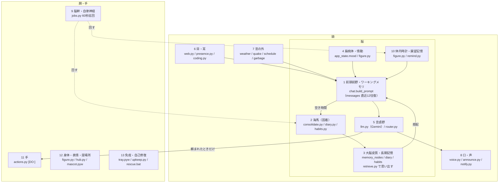

# 09 解剖図

人間の機能・部位と、ことはの処理（py・テーブル・bat）の対応。**大まかには人間と同じ流れ**で組んであり、軽くした部分も含めて、どこが同じで、どこが違うかを一枚に置きます。仕様の正はコードと [02 機能](02_機能.md) / [03 処理フロー](03_処理フロー.md) で、ここは読み替えの地図です。

## 結論

感覚 → ワーキングメモリ → 言語野で理解・生成 → 空き時間に海馬が長期記憶へ固着 → 使われない記憶は薄れる、という骨組みは揃っています。日記と習慣で「出来事が重なって意味に固まる」段も入りました。

違いは主に4つ。想起が毎回の検索であること、意識が連続しないこと、感情が5段の状態変数であること、日記が想起の検索に乗らないこと。末尾の「軽くした部分」に書いてあります。

## 人体図

番号は下の表と対応します。

## 対応表

| 番号 | 人間の機能・部位 | ことはの処理 | データ | いつ動くか |
|---|---|---|---|---|
| 1 | 前頭前野 / ワーキングメモリ | `talk/chat.py` の `build_prompt`。いま意識に上っているもの＝プロンプトそのもの。さっきまでの話題（`[TOPIC:]`）は窓が切れても続く | `messages`（直近12往復・3,000字）＋想起した記憶＋時刻・機嫌・話題・頼まれごと・日記・習慣 | 発言ごと |
| 2 | 海馬（固着） | `memory/consolidate.py`（会話→記憶）、`memory/diary.py`（1日→日記）、`memory/review.py`（夜に記憶どうしを寄せる・直す・閉じる）、`memory/habits.py`（日記→習慣） | `messages` → `memory_nodes`、`diary`、`habits` | 空き時間 / 日付が変わって / 週に一度 |
| 3 | 大脳皮質 / 長期記憶 | `memory/retrieve.py` で思い出す（強い記憶が先。日記も意味で引く。出なかったものは `jobs.maybe_afterthought` が後から「そういえば」）。`memory/embed.py`（Ollama bge-m3）で意味の近さ。`memory/strength.py` の強さが薄れ、床を切ると `db.run_maintenance` で消える | `memory_nodes`（strength、pinned は消えない）、`memory_edges`、`memory_tags`、`memory_vectors`、`diary_vectors` | 発言ごと / 24時間ごと |
| 4 | 扁桃体 / 情動 | 返事の `[MOOD:]`、時間帯の下地は `talk/figure.py`。中身は快−不快と元気−疲れの2軸（`chat.mood_axes`）で、黙っているあいだ半減期で下地へ戻る。相手への信頼は `habits.py` の週の振り返りで一段ずつ | `app_state.mood` / `mood_why` / `mood_at`、`trust` / `trust_why` | 返事のたび / 週に一度 |
| 5 | 言語野（理解・生成） | `talk/llm.py`（Gemini）。速い道・遅い道は `talk/router.py`（System 1 / 2 に近い） | — | 発言ごと、独り言のたび |
| 6 | 目・耳（相手を見る） | `serve/web.py`（テキスト・通話）、`talk/presence.py`（PCの様子＝体感）、`talk/coding.py` | `app_state.front_*` | 発言ごと / 毎分1回数える |
| 7 | 窓の外 | `talk/weather.py`、`quake.py`、`schedule.py`、`garbage.py`。ロックの外で取りに行く | `data/calendars`、work.json | 朝 |
| 8 | 口・声帯 | `serve/voice.py`（AivisSpeech）。自分から口を開く判断は `serve/announce.py`、届け方は `notify.py` か器のふきだし | `app_state.held_announcements` | 言うとき |
| 9 | 脳幹 / 自律神経 | `serve/jobs.py` の60秒巡回（整理・控え・忘却・日記・習慣・頼まれごと・朝の一言・見守り）。時計が回るのは `web.py` の lifespan だけ | `app_state.last_*` | 常に |
| 10 | 体内時計 / 展望記憶 | 時間帯で姿と気分が変わる表は `talk/figure.py`。「あとで言う」は `memory/remind.py`（追いかけ・繰り返し・取り消し） | `reminders` | 時刻が来たら |
| 11 | 手（行動） | `talk/actions.py`（`[DO:]`）。表にない操作はできない | `data/actions.log` | 頼まれたときだけ |
| 12 | 身体・表情・居場所 | `talk/figure.py`（立ち絵とふるまい）、`serve/hub.py`（実体はひとつ、器は複数）、`scripts/mascot.pyw` | `data/mascot.json` | 巡回の終わりと返事のたび |
| 13 | 免疫 / 自己修復 | `scripts/tray.pyw`（落ちたら上げ直す）、`talk/upkeep.py`（切れる前に言う）、`db.run_backup`、`scripts/rescue.bat` | `data/backups`、`tray.log`、`notify.log` | 落ちたとき、切れる前 |
| — | 人格・良心・しつけ | `prompts/persona.txt`、`prompts/fixed_rules.txt` | `data/prompts`（本人用の上書き） | 毎回プロンプトの先頭 |

## 記憶の流れ（人の一日と重ねる）

脳は「今」を全部は残さない。残るものは、空き時間と夜と週末に段階を踏んで固まる。ことはも同じ段で組んであります。

| いつ | 人間 | ことは | 中身 |
|---|---|---|---|
| 会話中（覚醒） | ワーキングメモリと連想 | `messages` 直近12往復＋機嫌・話題（`app_state`）。発言ごとに `retrieve.py` が連想する | 保護記憶（pinned）は常に。タグ命中と意味の近さで関連を、続きのある話（open_topic）は別枠で。思い出した記憶は `[USED:]` で申告され、強さが足される（間が空いてから思い出すほど大きく）。強い記憶ほど弱い手がかりでも出る |
| 会話が途切れてしばらく（休息） | 海馬の固着 | `consolidate.py` → `memory_nodes` | 未処理の往復（最大20往復）を出来事（episode）と意味（fact / preference / open_topic / procedure）に分け、既にある近い記憶へ寄せる。失敗3回で諦める（枠を守る） |
| 日付が変わって（一日の終わり） | 自伝的記憶 | `diary.py` → `diary`（1日1件） | その日の会話と言った頼まれごとを、ことは自身が三〜五行に。話さなかった日も1件（APIは使わない）。翌朝の一言と、会話（直近3日）で振り返る |
| 日記のあと（睡眠中の再生） | 記憶の再統合 | `review.py` → `memory_nodes` | ここ1週間の記憶を日記と見比べ、同じものを寄せ、食い違いを直し、済んだ話を閉じる。作りはしない。ピン留めは触らない |
| 週に一度（日記が7日ぶん） | 手続き記憶・習慣 | `habits.py` → `habits`（最大6件） | ここ2週間の日記を読み返し、「夜10時ごろに話しかけてくる」「土曜の夜は出かけがち」を拾う。挙がったものは確かめ直し、挙がらなかったものは退く（薄れる） |
| 24時間ごと（新陳代謝） | 忘却 | `db.run_maintenance` | 強さが日ごとに半分ずつ薄れ、床を切ったものを消す（ピン留めは残る）。その前に必ず控えを取る。長く使われないタグの数えも戻す |

## 軽くした部分（人と違うところ）

シンプルさのために意図して省いたもの。設計の欠陥ではなく、知っておくと「人ならこうするのに」のずれが読めます。

- **想起は毎回の検索。** 発言ごとにタグと意味で引き直す。「思い出せそうで出ない」は強さで作ってあり（薄れた記憶は強い手がかりが要る）、日記も意味で引け、出なかった記憶は会話が途切れてから「そういえば」と出てくる（1日1回）。ただし、それ以外に会話の外で連想が進むことはない
- **意識が続かない。** 往復ごとにプロンプトを組み直す。連続した「今」はなく、直近12往復の窓と、さっきまでの話題（`app_state.topic`）、覚えごとで繋いでいる。会話の外で「考え続ける」ことはない
- **感情は2軸と、5つのラベル。** 快−不快・元気−疲れの点が半減期で下地へ戻り、言葉はそこから出る。相手への信頼は週に一段ずつ。身体反応（空腹・痛み）や、複数の感情が同時にあることは表せない
- **固着はバッチで、再生は1日1回。** 空き時間の整理（会話→記憶）と、日記のあとの読み返し（記憶どうしを寄せる・直す・閉じる）の2段。人のように一晩に何度も再生はしないし、読み返すのはここ1週間ぶんだけ
- **忘却は一本の曲線。** 強さが半減期で薄れ、思い出すと足される。人の忘却曲線に寄せた最小の形で、記憶ごとの半減期の違いや、感情による定着の差はない。ピン留めは絶対に消えない
- **脳はひとつ、器は複数。** uvicorn のプロセス1つだけが脳。画面・トレイ・デスクトップの姿は器で、実体の居場所は脳が決める。CUI（`kotoha.bat`）だけは同じDBを直接触る

数値（12往復・3,000字・30日・180日・6件・24時間）は `.env.example` とコード内の定数です。仮置きした値と見直し方は [10 気になる点と見直し手順](10_気になる点と見直し手順.md)。
