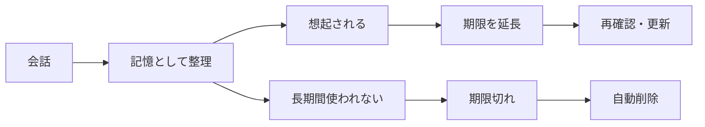
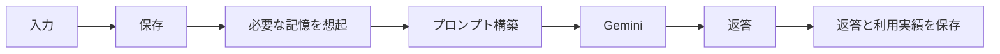
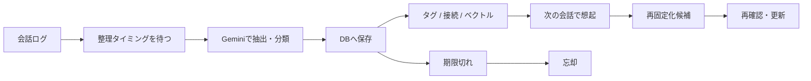
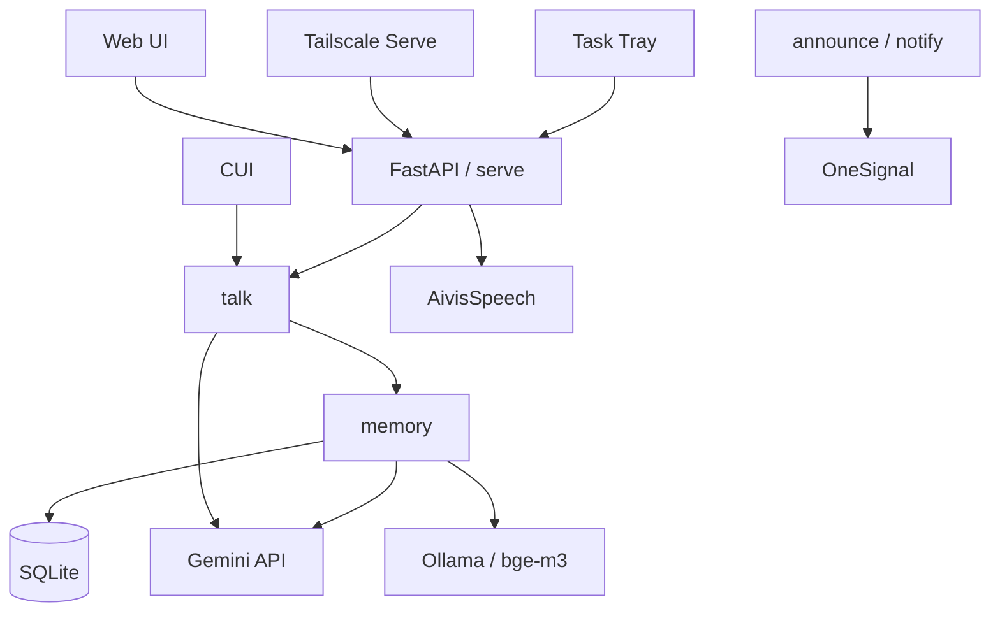
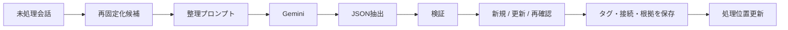
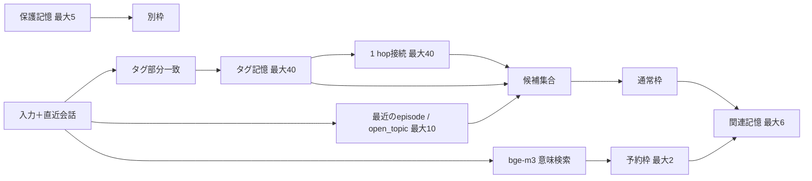
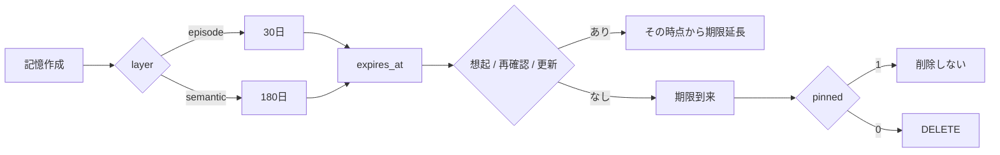
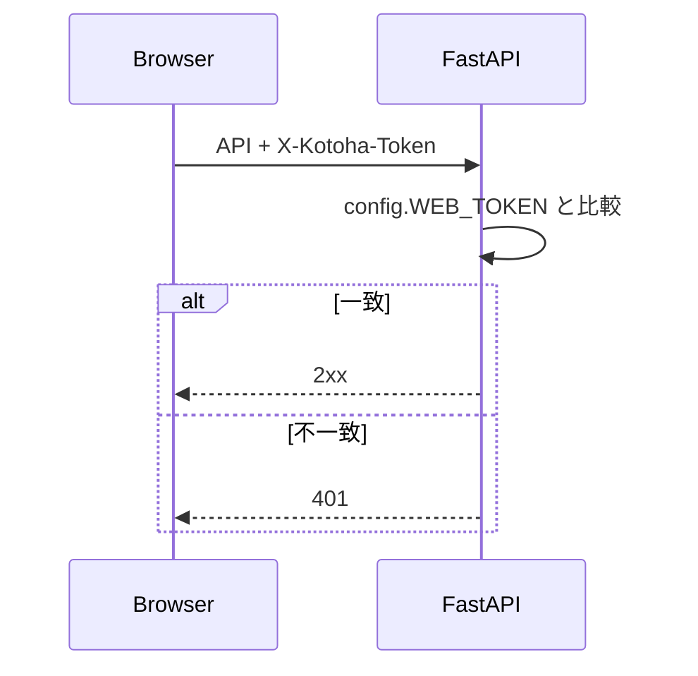

# 制作メモ

本稿は、PDF化の前段となるページ単位の原稿・図版指示書です。  
仕様は `README.md`、`docs/01〜05`、`docs/07` と、必要箇所の現行実装を一次情報として照合しています。

**Revision 2:** キャッチコピーと章見出しを全面的に再設計し、日本語の自然さ、用語の一貫性、実装との整合性を再レビューしています。章扉は英語の短いラベル、本文見出しは日本語中心とし、一般ユーザー向けの読みやすさと技術資料としての参照性を分離しました。

- PDF想定サイズ: A4縦
- 余白: 上下20mm / 左右18mm
- グリッド: 12カラム / 8pt
- 本文: 14〜15pt、行間1.5〜1.6
- 欧文: San Francisco。代替 Helvetica Neue
- 和文: ヒラギノ角ゴ。代替 Noto Sans JP
- 基本色: `#FFFFFF` / `#F2F2F7`
- 主文字: `#000000`
- 副文字: `#3C3C43` 60%
- アクセント: `#007AFF`
- 記憶: `#AF52DE`
- 音声: `#FF9500`
- 管理: `#34C759`
- 線画アイコン: SF Symbols相当。塗りアイコンや装飾的なピクトグラムは使用しない
- フッター: `ことは / Doc v2.0`
- 各ページ左上: 章番号
- 各ページ右上: ページ番号

注記: リポジトリ内にソフトウェアのSemVer定義が見当たらないため、資料上のバージョンは「Doc v2.0」とする。PDF制作時点で製品バージョンが定義された場合は差し替える。

---

<!-- PAGE 01 -->

# Page 01 — Cover

**章番号:** I  
**ページメッセージ:** 話して、覚えて、時々忘れる。

## タイトル

# ことは

話して、覚えて、時々忘れる。  
Windowsで動く、個人用AIパートナー。

**Document v2.0 / 2026.09.18**

## メインビジュアル指示

- `kotoha/serve/static/kotoha.png` または `avatar/kotoha_day_idle.png` を使用
- キャラクターは右下寄せ。余白を大きく残す
- 背景は白
- 装飾はシステムブルーの細線1本のみ
- 画像の輪郭処理は行わず、原画のピクセル感を保つ
- 画面キャプチャを重ねる場合は1枚まで

## 小さく記載

Source baseline: `main@2604b89`

---

<!-- PAGE 02 -->

# Page 02 — Core Values 01–03

**章番号:** I  
**ページメッセージ:** 会話AIに、記憶と時間の流れを。

## 1. 人のように、覚えて、忘れる

**アイコン:** `brain.head.profile` 相当  
**機能色:** 記憶パープル

会話から出来事や好みを抽出し、記憶として整理します。  
思い出した記憶は保持期間が延び、長く使われない記憶は期限後に自動削除されます。

想起された記憶は再固定化候補となり、次回の整理で再確認・更新できます。

## 2. 声で話せる

**アイコン:** `waveform` 相当  
**機能色:** 音声オレンジ

AivisSpeech互換エンジンで返答を読み上げます。  
音声入力はブラウザのWeb Speech APIを使い、音声入力・応答・読み上げを繰り返して通話できます。

読み上げ中はマイクを閉じ、音声の回り込みを防ぎます。

## 3. 言葉が違っても、思い出せる

**アイコン:** `point.3.connected.trianglepath.dotted` 相当  
**機能色:** 記憶パープル

作業記憶、エピソード記憶、意味記憶を使い分けます。  
意味記憶には `fact`、`preference`、`open_topic`、`procedure` を保持します。

タグ一致、記憶間の接続、Ollama `bge-m3` の意味検索を組み合わせ、言葉が一致しない関連記憶にも到達します。

> 実装上、「手続き記憶」は独立レイヤーではなく、意味記憶の `procedure` 種別です。

---

<!-- PAGE 03 -->

# Page 03 — Core Values 04–05 / Reading Guide

**章番号:** I  
**ページメッセージ:** 保存はローカル。外部送信は必要な処理だけ。

## 4. 安全なPC操作

**アイコン:** `switch.2` 相当  
**機能色:** 管理グリーン

PCの状態確認、音声エンジンやOllamaの起動・停止、ことは本体の再起動など、あらかじめ定義した操作だけを実行します。

任意のOSコマンドをAIが生成・実行する構成ではありません。  
実行できる操作は `talk/actions.py` に定義し、実行記録は `data/actions.log` に残します。

## 5. ローカル保存を中心にした設計

**アイコン:** `internaldrive` 相当  
**機能色:** システムブルー

会話と記憶の保存先はローカルSQLite。  
意味検索もOllamaを使い、PC内で処理します。

Gemini APIには、応答生成・記憶整理に必要な会話と記憶の一部だけを送信します。  
音声認識はブラウザのWeb Speech API、通知を有効にした場合はOneSignalを利用します。

## Reading Guide

| 対象 | 章 | 内容 |
|---|---|---|
| 一般ユーザー | II〜IV | できること、画面、仕組み |
| 実装・保守担当 | V〜VII | 構成、処理フロー、DB/API、運用 |

---

<!-- PAGE 04 -->

# Page 04 — Capabilities

**章番号:** II  
**ページメッセージ:** できること

# ことはができること

会話。  
記憶。  
音声・通知。  
PC操作。

**レイアウト指示:** 中央に4語。周囲に細い4本の線。説明文は置かない。

---

<!-- PAGE 05 -->

# Page 05 — Capabilities Map

**章番号:** II  
**ページメッセージ:** 日常のやり取りを、4つの機能で支える。

| カテゴリ | 代表機能 | 一言 |
|---|---|---|
| 会話 | Web / CUI、Fast/Slow、機嫌・時間帯 | 直近の文脈を踏まえて応答 |
| 記憶 | 抽出、想起、再固定化、忘却、保護 | 必要な記憶を残し、古い記憶は忘れる |
| 音声・通知 | 読み上げ、通話、リマインド、Web Push | 声で話し、必要なときに通知 |
| 管理 | 設定、記憶編集、PC状態、再起動 | 必要な範囲だけ確認・操作 |

## 会話

- ブラウザとCUIの両方から利用
- 直近会話を参照
- 現在時刻、前回からの間隔、時間帯、機嫌をプロンプトへ反映
- Fast/Slowルートを用意。既定はSlow

## 記憶

- 会話からエピソード・意味記憶を整理
- タグ、接続、ベクトルで想起
- よく使う記憶は期限を延長
- 保護、本文修正、明示削除に対応

---

<!-- PAGE 06 -->

# Page 06 — Memory Model

**章番号:** II  
**ページメッセージ:** 記憶は「保存する」だけではなく、「使われ方」で残り方が変わる。

## 作業記憶

`messages` の直近会話。  
既定は5往復、最大3,000文字をプロンプトに含めます。

## エピソード記憶

`memory_nodes.layer = episode`  
`kind = event`

出来事を扱います。  
新規時の保持期間は既定30日です。

## 意味記憶

`memory_nodes.layer = semantic`

- `fact`: 事実
- `preference`: 好み
- `open_topic`: 継続中の話題
- `procedure`: 手続き・やり方

新規時の保持期間は既定180日です。

## 記憶の保持



**図版色:** 記憶ノードはパープル。期限切れ経路はグレー。削除は色ではなく破線とラベルでも示す。

---

<!-- PAGE 07 -->

# Page 07 — Voice, Notifications & Control

**章番号:** II  
**ページメッセージ:** 声で話し、必要なタイミングで知らせ、設定やPC状態を管理する。

## 音声・通知

- AivisSpeech互換エンジンによる読み上げ
- ブラウザのWeb Speech APIによる音声入力
- 通話は1台を所有者として管理
- リマインド
- 音声エンジン / Ollama停止通知
- Cドライブ空き容量警告
- 朝のひとこと、見守り、暇なときの声かけ
- OneSignal Web Push

## 管理

- Web設定画面から9項目を変更
- 人格・固定ルール・記憶整理プロンプトを編集
- 記憶の参照、本文修正、保護、削除
- 頼まれごとの確認・取り消し
- PCの状態確認
- 通話所有権の解除
- アプリ再起動

## 安全側の設計

AIが任意のOSコマンドを組み立てるのではなく、`talk/actions.py` の定義済み操作だけを実行します。

---

<!-- PAGE 08 -->

# Page 08 — Interfaces

**章番号:** III  
**ページメッセージ:** 画面と操作の入口

# コントロール範囲は必要最小限。

ブラウザ。  
ターミナル。  
タスクトレイ。  
設定シート。

**レイアウト指示:** 4つの線画アイコンを横一列。本文なし。

---

<!-- PAGE 09 -->

# Page 09 — Web Chat

**章番号:** III  
**ページメッセージ:** 会話は中央。操作は必要なときだけ。

## スクリーンショット枠

**PDF制作時に実機キャプチャへ差し替え。**  
リポジトリには完成画面のスクリーンショットがないため、原稿段階ではキャプチャ指示のみとする。

**推奨キャプチャ条件**

- Windowsブラウザ
- 1440×1000px以上
- 通常会話が3〜4往復見える状態
- キャラクター表示あり
- 入力欄が空の状態
- Fast/Slow表示が見える状態

## 注釈

1. キャラクター  
   時間帯に応じてアバターを切り替え。瞬き差分を持つ。

2. 会話履歴  
   `GET /api/history` で初期表示。既定40メッセージ。

3. 処理モード  
   `/api/chat` の `mode` をヘッダーへ表示。

4. 入力  
   PCではEnter送信、Shift+Enter改行。タッチ端末ではEnterを改行として扱う。

5. 通話  
   対応ブラウザのみ表示。音声入力と読み上げを繰り返す。

6. 設定  
   プロンプト、設定、記憶、頼まれごと、PC状態へ1段で移動。

**表示ルール:** 注釈番号は白丸＋黒字。引き出し線は0.75pt。色だけで区別しない。

---

<!-- PAGE 10 -->

# Page 10 — CUI & System Tray

**章番号:** III  
**ページメッセージ:** 必要なときだけ開き、普段はタスクトレイに常駐する。

## CUI

**スクリーンショット指示**

- `kotoha.bat` で会話
- 直近会話が復元された状態
- 入力と返答を2往復程度
- 管理コマンドは別キャプチャにしない

**役割**

- テキスト会話
- 手動整理
- バックアップ
- 記憶管理
- status確認

## タスクトレイ

**スクリーンショット指示**

Windowsの通知領域からメニューを開き、次の行が同時に見える状態を撮影。

- ことはを開く
- 手を貸す
- ことは / 音声エンジン / Ollamaの状態
- 入れ直す
- 終わる

左クリックで会話画面を開きます。  
状態は10秒ごとに裏で更新され、ことは停止時は別アイコン `kotoha_off.ico` を使用します。

---

<!-- PAGE 11 -->

# Page 11 — Settings & Memory

**章番号:** III  
**ページメッセージ:** 日常的な調整はWebから。詳細設定は `.env` から。

## 設定シート

Webから直接変更できるのは9項目です。

| グループ | 項目 |
|---|---|
| 話し方 | `KOTOHA_TEMPERATURE`, `KOTOHA_MAX_OUTPUT_TOKENS` |
| 覚えること | `KOTOHA_RECENT_TURNS`, `KOTOHA_RECENT_CHARS`, `KOTOHA_IDLE_SECONDS` |
| 声 | `KOTOHA_VOICE_STYLE_ID` |
| ことはから | `KOTOHA_BRIEFING_ENABLED`, `KOTOHA_LOOKOUT_ENABLED`, `KOTOHA_REACH_OUT_ENABLED` |

変更内容は `.env` へ保存し、その場で設定を再読込します。

## 記憶管理

- 意味記憶 / できごと / 保護を切替
- 各一覧最大40件
- 本文編集
- 保護切替
- 明示削除
- タグと根拠発言IDを詳細画面で確認

本文を修正すると確認日時と期限を更新し、既存ベクトルを破棄して次回巡回で再生成します。

---

<!-- PAGE 12 -->

# Page 12 — How It Works

**章番号:** IV  
**ページメッセージ:** ことはの内部で起きていることを、4つの流れで見る。

# 会話処理の流れ

会話。  
記憶。  
音声。  
データ管理。

---

<!-- PAGE 13 -->

# Page 13 — Conversation & Memory

**章番号:** IV  
**ページメッセージ:** 会話中にすべてを整理せず、会話が落ち着いてから記憶をまとめる。

## 会話



**ポイント**

- ユーザー入力はLLM呼び出しより先に保存
- 生成に失敗しても入力は残る
- 返答から内部タグ `[USED:]` `[MOOD:]` `[REMIND:]` `[DO:]` を除いて画面へ返す

## 記憶



記憶整理はWebでは会話が5分途切れた後に実行。  
会話中に記憶本文を直接更新しません。

---

<!-- PAGE 14 -->

# Page 14 — Voice & Privacy

**章番号:** IV  
**ページメッセージ:** ローカル中心。ただし、外部サービスへ渡る情報を明確に分ける。

## 音声通話

```mermaid
flowchart LR
    M[マイク] --> W[Web Speech API]
    W --> T[テキスト]
    T --> C[/api/chat]
    C --> R[返答]
    R --> V[AivisSpeech]
    V --> O[音声再生]
    O --> M
```

- 音声入力: Chrome / EdgeのWeb Speech API
- 読み上げ: ローカルAivisSpeech互換エンジン
- 読み上げ中はマイクを開かない
- 割り込み発話は未対応

## データの扱い

| レーン | データ | 主な送信先 |
|---|---|---|
| ローカル | 会話原文、記憶、タグ、接続、ベクトル、バックアップ | SQLite / Ollama / AivisSpeech |
| クラウド | 応答生成・整理に必要な会話と記憶 | Gemini API |
| クラウド | 音声認識時の音声 | ブラウザの音声認識サービス |
| クラウド | 通知本文。無効化可能 | OneSignal |

`KOTOHA_PUSH_SHOW_TEXT=false` ならOneSignalへ通知本文を渡さず、「ことはから」のみ表示します。

---

<!-- PAGE 15 -->

# Page 15 — Architecture

**章番号:** V  
**ページメッセージ:** 技術仕様 基礎編

# アプリが壊れても、記憶は消えない。

会話と記憶はSQLiteへ保存。  
補助機能や外部サービスは、会話処理との境界を分けて接続します。

---

<!-- PAGE 16 -->

# Page 16 — System Architecture

**章番号:** V  
**ページメッセージ:** 1つのローカルアプリを中心に、必要な外部機能だけ接続する。



## 技術スタック

| 項目 | 実装 |
|---|---|
| 言語 | Python 3.10+ |
| DB | SQLite |
| Web API | FastAPI |
| HTTP | httpx |
| Webサーバー | uvicorn |
| LLM | Gemini API OpenAI互換 `/chat/completions` |
| 既定モデル | `gemini-3.5-flash-lite` |
| 音声合成 | AivisSpeech等のVOICEVOX互換エンジン |
| 音声入力 | Web Speech API |
| ベクトル | Ollama `bge-m3` |
| リモート | Tailscale Serve |
| Push | OneSignal |

---

<!-- PAGE 17 -->

# Page 17 — Modules & Responsibilities

**章番号:** V  
**ページメッセージ:** 会話・記憶・配信の責務を分け、変更範囲を追いやすくする。

```text
kotoha/
  launcher.py
  cli.py
  config.py
  settings.py
  talk/
    chat.py
    llm.py
    router.py
    actions.py
    presence.py
    weather.py
  memory/
    db.py
    retrieve.py
    consolidate.py
    embed.py
    remind.py
  serve/
    web.py
    jobs.py
    announce.py
    voice.py
    admin.py
    static/
```

| モジュール | 責務 |
|---|---|
| `launcher.py` | 起動前確認、Tailscale Serve、ブラウザ表示 |
| `talk/chat.py` | 会話保存、プロンプト生成、返答処理、機嫌 |
| `talk/router.py` | Fast / Slow判定 |
| `talk/llm.py` | Gemini API通信 |
| `memory/retrieve.py` | 記憶想起 |
| `memory/consolidate.py` | 記憶整理・再固定化 |
| `memory/embed.py` | ベクトル生成・類似度・接続 |
| `memory/db.py` | スキーマ、DB操作、忘却、バックアップ |
| `serve/web.py` | 内部Web API |
| `serve/jobs.py` | 60秒巡回、排他制御 |
| `serve/announce.py` | 自発発言と通知の唯一の入口 |
| `serve/voice.py` | AivisSpeech連携 |
| `serve/admin.py` | Web設定・プロンプト編集 |

---

<!-- PAGE 18 -->

# Page 18 — Flow Index

**章番号:** V  
**ページメッセージ:** 保守時は、どの処理フローで問題が起きているかから追う。

| フロー | 入口 | 主な実装 | 詳細 |
|---|---|---|---|
| 会話生成 | `/api/chat`, CUI | `talk/chat.py`, `talk/router.py`, `talk/llm.py` | Page 20 |
| 記憶抽出・整理 | idle / CUI / command | `memory/consolidate.py` | Page 21 |
| 記憶想起 | 会話生成中 | `memory/retrieve.py`, `memory/embed.py` | Page 22 |
| 忘却・保守 | 24h / CUI終了 | `memory/db.py`, `serve/jobs.py` | Page 23 |
| DB | 全機能 | `memory/db.py` | Page 24–25 |
| Web API | Web UI | `serve/web.py` | Page 26 |
| バックアップ | 24h / command | `memory/db.py` | Page 29 |

## 排他制御

Web会話とバックグラウンド処理は同一プロセスの `threading.Lock` を共有します。  
別プロセスのCUIや管理コマンドとの排他にはなりません。

---

<!-- PAGE 19 -->

# Page 19 — Deep Dive

**章番号:** VI  
**ページメッセージ:** 技術仕様 詳細編

# 入力から、返答まで。  
# 覚えてから、忘れるまで。

この章では、実装を処理単位で追います。

---

<!-- PAGE 20 -->

# Page 20 — Conversation Flow

**章番号:** VI  
**ページメッセージ:** 入力を先に残し、必要な文脈だけ組み立てて生成する。

```mermaid
flowchart LR
    A[POST /api/chat] --> B[X-Kotoha-Token]
    B --> C[turn_lock]
    C --> D[入力を保存・commit]
    D --> E[直近会話]
    E --> F[Fast / Slow]
    F --> G[記憶想起]
    G --> H[プロンプト]
    H --> I[Gemini]
    I --> J[内部タグ解析]
    J --> K[返答・機嫌・利用実績保存]
    K --> L[reply / mode]
```



## ステップ仕様

1. `turn_id = MAX(turn_id) + 1`
2. ユーザー入力を `messages` に保存して即コミット
3. 直近 `KOTOHA_RECENT_TURNS × 2` メッセージを取得
4. 合計文字数が `KOTOHA_RECENT_CHARS` を超える間、古い発言を除外
5. Fast / Slowを判定
6. Slowでは関連記憶を取得
7. 1件のuserメッセージとしてGeminiへ送信
8. 内部タグを解析・除去
9. 返答、機嫌、利用記憶、再固定化候補を保存

## プロンプトの組み込み順

1. `prompts/fixed_rules.txt`
2. `prompts/persona.txt`
3. 現在時刻 / 曜日 / 前回からの間隔 / 時間帯 / 機嫌
4. 保護記憶 最大5件
5. 関連記憶 最大6件
6. 必要時のみPC状態と実行可能アクション
7. 直近会話
8. 今回の入力

## Fast / Slow

```text
FAST_ENABLED=false                         -> slow
入力 > FAST_MAX_CHARS                      -> slow
QUESTION_WORDS / PAST_WORDS / OP_WORDS    -> slow
登録済みタグと一致                         -> slow
それ以外                                   -> fast
```

Fastは保護記憶だけを渡します。  
1行目が `NEEDS_SEARCH` の場合、同じターンをSlowで再生成し `slow+fallback` とします。

## エラー

- 通信エラー / 5xx / 空応答: 既定2回まで再試行
- 429: 再試行せずエラー
- 400 / 401: 即エラー
- 応答形式不正: 即エラー
- Web: HTTP 502
- 入力は残るが、失敗した返答は保存しない

---

<!-- PAGE 21 -->

# Page 21 — Memory Consolidation

**章番号:** VI  
**ページメッセージ:** 会話中に直接書き換えず、まとめて整理する。



## 実行タイミング

| 経路 | 条件 |
|---|---|
| CUI起動時・返答後 | 未処理10ターン以上 |
| CUI `/consolidate` | 無条件 |
| Web巡回 | 60秒ごとに確認し、未処理あり＋最終会話から300秒超 |
| `kotoha.bat consolidate` | 無条件 |

1回の処理は最大20ターン / 20,000文字。  
新規記憶は最大8件、更新は最大4件です。

## 分類基準

| layer | kind | 本文上限 |
|---|---|---:|
| `episode` | `event` | 400字 |
| `semantic` | `fact` | 200字 |
| `semantic` | `preference` | 200字 |
| `semantic` | `open_topic` | 200字 |
| `semantic` | `procedure` | 200字 |

## タグ生成

- LLM出力の `tags` を使用
- 1ノード最大3個
- 前後空白を除去
- 連続空白を1つへ正規化
- 1タグ最大24文字
- 重複タグは除外

## 接続生成

- 整理時: 今回新規作成したノード同士の `derived_from`
- ベクトル巡回時: 類似記憶間の `related_to`
- 自己接続は禁止
- `related_to` は `KOTOHA_EMBED_LINK_FLOOR=0.80` 以上、1ノード最大3本

## 重複候補

新規候補をベクトル化し、既存記憶との類似度が `KOTOHA_EMBED_MERGE_FLOOR=0.90` 以上なら新規作成せず、既存ノードを再確認します。

---

<!-- PAGE 22 -->

# Page 22 — Memory Retrieval

**章番号:** VI  
**ページメッセージ:** 1つの総合スコアではなく、検索方式ごとに役割と枠を分ける。



## 検索方式

| 方式 | 実装 | 閾値 / 上限 |
|---|---|---|
| タグ | 文字列部分一致 | 候補40件 |
| 接続 | タグ候補から1 hop | 40件 |
| 最近 | `episode` / `open_topic` | 10件 |
| ベクトル | Ollama `bge-m3` | コサイン類似度 0.62以上、最大2件 |
| 保護 | `pinned=1` | 別枠5件 |
| 最終関連記憶 | 上記を統合 | 6件 |

## 統合方式

現実装に「タグ0.4 + ベクトル0.6」のような重み付き総合スコアはありません。

- ベクトル検索用に6枠のうち既定2枠を予約
- 残りをタグ / 接続 / 最近の候補が順に埋める
- ベクトルで閾値以上の候補がない場合、その予約枠を通常候補へ戻す
- タグ候補内の優先順は `use_count`、`last_used_at`、`confirmed_at`

## ベクトル仕様

- 既定モデル: `bge-m3`
- 次元数: 現行 `bge-m3` では1024
- 保存: 正規化済み `float32` 配列をBLOB化
- 1件: 4,096 bytes
- 類似度: 単位ベクトル同士の内積（コサイン類似度と同値）
- クエリ: 直前2行＋今回の発言
- 本文最大: 400文字
- 会話時タイムアウト: 1.5秒
- 失敗後リトライ抑制: 60秒

`KOTOHA_EMBED_FLOOR=0.62` は実測から置かれた暫定値です。

---

<!-- PAGE 23 -->

# Page 23 — Retention & Forgetting

**章番号:** VI  
**ページメッセージ:** 思い出した記憶は保持期間が延び、長く使われない記憶は期限後に削除される。



## 期限

- `episode`: 30日
- `semantic`: 180日
- 新規時は最初の有効な根拠発言日時を基準
- 想起・再確認・本文更新時に同じ日数を延長
- `MAX(既存期限, 新期限)` のため短縮しない
- `expires_at IS NULL` は無期限のまま

## 定期メンテナンス

Webでは既定24時間ごとに実行します。  
CUIでは終了時に実行します。

処理内容:

1. `pinned=0` かつ期限切れの記憶を削除
2. 30日未使用タグの `use_count` を0へ戻す
3. `last_forget_at` を更新

## 保護フラグ

`pinned` は自動削除を防ぐためのフラグです。  
本文更新や明示削除を禁止するものではありません。  
また、期限切れの記憶を想起対象へ戻す機能ではありません。

## 再固定化

会話で `[USED:id]` として使われたIDを `pending_reconsolidation_ids` に最大50件保持。  
次回整理で既存記憶として渡し、LLMの `reconfirm_ids` / `updates` により再確認・更新できます。

---

<!-- PAGE 24 -->

# Page 24 — Database Design

**章番号:** VI  
**ページメッセージ:** 会話原文と記憶を分離し、根拠を辿れる構造にする。

```mermaid
erDiagram
    messages ||--o{ memory_sources : source
    memory_nodes ||--o{ memory_sources : has
    memory_nodes ||--o{ memory_tags : tagged
    memory_nodes ||--o{ memory_edges : from
    memory_nodes ||--o{ memory_edges : to
    memory_nodes ||--o| memory_vectors : vector
    reminders {
        INTEGER id PK
        TEXT due_at
        TEXT text
        TEXT created_at
        TEXT done_at
    }
    app_state {
        TEXT key PK
        TEXT value
    }
    messages {
        INTEGER id PK
        INTEGER turn_id
        TEXT role
        TEXT text
        TEXT created_at
        INTEGER extractable
    }
    memory_nodes {
        INTEGER id PK
        TEXT layer
        TEXT kind
        TEXT text
        TEXT occurred_at
        TEXT confirmed_at
        TEXT last_used_at
        TEXT expires_at
        INTEGER pinned
        TEXT source_summary
        TEXT source_key
    }
    memory_tags {
        INTEGER node_id PK
        TEXT tag PK
        INTEGER use_count
        TEXT last_used_at
        INTEGER last_used_turn_id
    }
    memory_edges {
        INTEGER from_id PK
        INTEGER to_id PK
        TEXT relation PK
    }
    memory_sources {
        INTEGER node_id PK
        INTEGER message_id PK
    }
    memory_vectors {
        INTEGER node_id PK
        TEXT model
        BLOB vector
    }
```

## バックアップ履歴について

`backup_history` のようなDBテーブルは実装されていません。

- バックアップ実体: `data/backups/kotoha_*.sqlite3`
- 最終自動バックアップ時刻: `app_state.last_backup_at`
- 保持数: `KOTOHA_BACKUP_KEEP`

ER図ではバックアップをDBエンティティとして描かず、SQLite外部のファイルストレージとして別枠表示します。

---

<!-- PAGE 25 -->

# Page 25 — Constraints & Lifecycle

**章番号:** VI  
**ページメッセージ:** 制約をDB側にも置き、壊れた状態を作りにくくする。

## 主な制約

| テーブル | 制約 |
|---|---|
| `messages` | `UNIQUE(turn_id, role)`、roleはuser/assistant |
| `memory_nodes` | `source_key UNIQUE`、layer/kind整合性CHECK |
| `memory_edges` | `(from_id,to_id,relation)` PK、自己接続禁止 |
| `memory_tags` | `(node_id,tag)` PK、`use_count` 0〜3 |
| `memory_sources` | `(node_id,message_id)` PK |
| `memory_vectors` | `node_id` PK、ノード削除時CASCADE |

## インデックス

- `messages(created_at, id)`
- `memory_tags(tag, node_id)`
- `memory_nodes(expires_at)`
- `memory_nodes(layer, confirmed_at)`
- `memory_edges(from_id, relation)`
- `memory_edges(to_id, relation)`
- `memory_sources(message_id, node_id)`
- `reminders(done_at, due_at)`

## 記憶ライフサイクル

```text
会話
  -> 整理候補
  -> 検証
  -> memory_nodes
  -> tags / sources / edges
  -> vector生成
  -> 想起
  -> last_used_at + expires_at延長
  -> 再固定化候補
  -> reconfirm / update
  -> 未使用なら期限切れ
  -> maintenanceで削除
```

削除時、接続・タグ・出典・ベクトルは外部キーCASCADEで削除されます。  
会話原文とバックアップは残ります。

---

<!-- PAGE 26 -->

# Page 26 — API & Integrations

**章番号:** VI  
**ページメッセージ:** UI用APIはトークンで保護し、外部サービス連携を明確な境界に集約する。

## 認証

`/`、静的ファイル、OneSignal Service Workerを除くWeb APIは `X-Kotoha-Token` を検証します。  
ブラウザは認証成功後、トークンを `localStorage` に保持します。



## 主要エンドポイント

| Method | Path | 主な入出力 |
|---|---|---|
| GET | `/api/history?limit=40` | 会話履歴 |
| POST | `/api/chat` | `{"text": ...}` -> `reply`, `mode`, 任意で`kept` |
| POST | `/api/speak` | `{"text": ...}` -> `audio/wav` |
| GET/POST/DELETE | `/api/call` | 通話所有者の確認・取得・解除 |
| GET | `/api/memories?kind=` | `semantic` / `episode` / `pinned` |
| GET/PUT/DELETE | `/api/memories/{id}` | 詳細・本文更新・削除 |
| PUT | `/api/memories/{id}/pinned` | `{"pinned": true/false}` |
| GET | `/api/reminders` | 未完了リマインド |
| DELETE | `/api/reminders/{id}` | 取消 |
| POST | `/api/reminders/snooze` | `{"ids":[...]}` |
| GET | `/api/prompts` | 3プロンプト |
| PUT | `/api/prompts/{name}` | 本文更新 |
| POST | `/api/prompts/{name}/revert` | 1世代前と入替 |
| GET/PUT | `/api/settings` | Web公開9設定 |
| GET | `/api/machine` | PC状態 |
| GET | `/api/push` | OneSignal App ID |
| POST | `/api/restart` | 終了コード42で再起動要求 |

## Gemini

- Base: `https://generativelanguage.googleapis.com/v1beta/openai`
- Endpoint: `/chat/completions`
- Auth: `Authorization: Bearer <GEMINI_API_KEY>`
- 既定モデル: `gemini-3.5-flash-lite`
- 会話出力上限: 1,024
- 整理出力上限: 1,500
- timeout: 60秒
- retry: 2回
- streaming: 未使用

保守注記: Googleの2026-07-21リリースノートではGemini 3.xの `temperature` / `top_p` / `top_k` がdeprecatedとされています。現実装はOpenAI互換エンドポイントへ `temperature=0.8` を送信しているため、将来の互換性確認項目とします。

## Ollama

- Base: `http://127.0.0.1:11434`
- Endpoint: `/api/embed`
- Model: `bge-m3`
- 入力: 記憶本文または直近文脈＋発言
- 出力: 1024次元
- 保存前に単位長へ正規化

---

<!-- PAGE 27 -->

# Page 27 — Operations

**章番号:** VII  
**ページメッセージ:** 運用・保守・付録

# 普段は触らない。  
# 必要なときに、すぐ確認できる。

設定、起動、復元、障害切り分けを1か所にまとめます。

---

<!-- PAGE 28 -->

# Page 28 — Default Configuration

**章番号:** VII  
**ページメッセージ:** 初期値は `.env.example` に一元化する。

| 項目 | 初期値 | 変更 |
|---|---:|---|
| `GEMINI_MODEL` | `gemini-3.5-flash-lite` | `.env` |
| `KOTOHA_MAX_OUTPUT_TOKENS` | 1024 | `.env` / Web |
| `KOTOHA_TIMEOUT_SECONDS` | 60 | `.env` |
| `KOTOHA_LLM_ATTEMPTS` | 2 | `.env` |
| `KOTOHA_WEB_TOKEN` | 空 | `.env` |
| `KOTOHA_WEB_PORT` | 8000 | `.env` |
| `KOTOHA_RECENT_TURNS` | 5 | `.env` / Web |
| `KOTOHA_RECENT_CHARS` | 3000 | `.env` / Web |
| `KOTOHA_IDLE_SECONDS` | 300 | `.env` / Web |
| `KOTOHA_EPISODE_DAYS` | 30 | `.env` |
| `KOTOHA_SEMANTIC_DAYS` | 180 | `.env` |
| `KOTOHA_RELATED_LIMIT` | 6 | `.env` |
| `KOTOHA_PINNED_LIMIT` | 5 | `.env` |
| `KOTOHA_EMBED_MODEL` | `bge-m3` | `.env` |
| `KOTOHA_EMBED_FLOOR` | 0.62 | `.env` |
| `KOTOHA_EMBED_RESERVE` | 2 | `.env` |
| `KOTOHA_BACKUP_KEEP` | 7 | `.env` |
| `KOTOHA_BACKUP_INTERVAL_SECONDS` | 86400 | `.env` |
| `KOTOHA_MAINTENANCE_SECONDS` | 86400 | `.env` |
| `KOTOHA_VOICE_BASE_URL` | `http://127.0.0.1:10101` | `.env` |
| `KOTOHA_VOICE_STYLE_ID` | 1878365376 | `.env` / Web |

## Gemini無料枠

2026-09-18時点で `gemini-3.5-flash-lite` はGoogle公式料金表上、Standard APIのFree Tierで入力・出力とも無料対象です。Free Tierのデータ利用条件はGoogleの規約・料金表に従います。

RPM / TPM / RPDの上限はプロジェクトの利用ティアやアカウント状態で変動し、公式ドキュメントも固定値を保証していません。  
資料では上限値を固定せず、Google AI Studioに表示されるActive rate limitsを正とします。

レート超過時、ことははHTTP 429を再試行せず呼び出し元へ返します。

---

<!-- PAGE 29 -->

# Page 29 — Setup & Maintenance

**章番号:** VII  
**ページメッセージ:** 起動と復元は単純に。障害時は、保存・通信・補助機能を分けて切り分ける。

## セットアップ

1. WindowsへPython 3.10以上を用意
2. `setup.bat` で仮想環境と依存関係を準備
3. `settings.bat` で `.env` を作成・編集
4. `GEMINI_API_KEY` と `KOTOHA_WEB_TOKEN` を設定
5. `start.bat` を実行
6. 必要に応じてAivisSpeech、Ollama、Tailscaleを導入

通常起動は `start.bat`。  
常駐は `kotoha.bat tray`。  
ログイン時常駐は `kotoha.bat autostart on`。

## よくある症状

| 症状 | 確認 |
|---|---|
| APIキー未設定 | `.env` の `GEMINI_API_KEY` |
| `fastapi` / `uvicorn` 不足 | `setup.bat` |
| `no such table` | DB初期化と `KOTOHA_DB_PATH` |
| Webトークン無効 | `.env` と画面入力を一致 |
| 認証・モデルエラー | APIキーとモデルID |
| 429 | GeminiのActive rate limits |
| 音声が出ない | AivisSpeech、`KOTOHA_VOICE_ENABLED`、10101番 |
| 意味検索しない | Ollama、`bge-m3`、11434番 |
| 通知が届かない | PWA購読、OneSignal設定、`data/notify.log` |

## ログ

- 操作: `data/actions.log`
- 通知: `data/notify.log`
- Web詳細: `KOTOHA_DEBUG=true` で表示

## バックアップ復元

1. CUI / Webを停止
2. 現在のDBを別名で退避
3. `data/backups/` から対象の `kotoha_*.sqlite3` を選択
4. 設定中の `KOTOHA_DB_PATH` へ配置
5. 起動後に `status` と記憶一覧を確認

バックアップに `.env` とプロンプトは含まれません。  
会話・記憶を含むため、元DBと同じ機密度で扱います。

---

# 出典

## 一次情報

- Repository: https://github.com/shoya44/kotoha
- Baseline commit: https://github.com/shoya44/kotoha/commit/2604b891a1675d4f73902989b740dce68baecd98
- README: https://github.com/shoya44/kotoha/blob/main/README.md
- 全体仕様: https://github.com/shoya44/kotoha/blob/main/docs/01_全体仕様.md
- DB仕様: https://github.com/shoya44/kotoha/blob/main/docs/02_DB仕様.md
- AP仕様: https://github.com/shoya44/kotoha/blob/main/docs/03_AP仕様.md
- LLM・設定・プロンプト方針: https://github.com/shoya44/kotoha/blob/main/docs/04_LLM・設定・プロンプト方針.md
- UI・運用・Tailscale: https://github.com/shoya44/kotoha/blob/main/docs/05_UI・運用・Tailscale.md
- 処理フロー: https://github.com/shoya44/kotoha/blob/main/docs/07_処理フロー.md
- 設定初期値: https://github.com/shoya44/kotoha/blob/main/.env.example
- DB実装: https://github.com/shoya44/kotoha/blob/main/kotoha/memory/db.py
- 記憶想起: https://github.com/shoya44/kotoha/blob/main/kotoha/memory/retrieve.py
- ベクトル実装: https://github.com/shoya44/kotoha/blob/main/kotoha/memory/embed.py
- 記憶整理: https://github.com/shoya44/kotoha/blob/main/kotoha/memory/consolidate.py
- Web API: https://github.com/shoya44/kotoha/blob/main/kotoha/serve/web.py

## 公式外部情報

- Apple Human Interface Guidelines: https://developer.apple.com/design/human-interface-guidelines/
- Apple HIG / Layout: https://developer.apple.com/design/human-interface-guidelines/layout
- Apple HIG / Color: https://developer.apple.com/design/human-interface-guidelines/color
- Apple HIG / Typography: https://developer.apple.com/design/human-interface-guidelines/typography
- Apple HIG / Accessibility: https://developer.apple.com/design/human-interface-guidelines/accessibility
- Gemini API models: https://ai.google.dev/gemini-api/docs/models
- Gemini 3.5 Flash-Lite: https://ai.google.dev/gemini-api/docs/models/gemini-3.5-flash-lite
- Gemini API pricing: https://ai.google.dev/gemini-api/docs/pricing
- Gemini API rate limits: https://ai.google.dev/gemini-api/docs/rate-limits
- Gemini API release notes: https://ai.google.dev/gemini-api/docs/changelog
- Ollama bge-m3: https://ollama.com/library/bge-m3
- Ollama bge-m3 model metadata: https://ollama.com/library/bge-m3/blobs/daec91ffb5dd

---

# Revision 2 セルフレビュー

- 表紙・章扉・Core Valuesの見出し階層を統一し、内部用の「売り1 / 売り2」表記を廃止。
- キャッチコピーを「話して、覚えて、時々忘れる。」へ統一。
- 「手を貸す」「薄れる」など意味が曖昧な擬人表現を、PC操作・保持期間・削除など具体的な語へ置換。
- 「ことはでできること」を「ことはができること」へ修正。
- 章扉は `Capabilities / Interfaces / How It Works / Architecture / Deep Dive / Operations` に統一。
- アーキテクチャ図のTailscale経路を、Web UI側ではなくFastAPIへの中継として修正。
- `pinned` は自動削除を防ぐだけで、期限切れ記憶を想起可能に戻さない点を追記。
- API認証の例外範囲にOneSignal Service Workerを明記。
- ベクトル類似度を「cosine相当」から「コサイン類似度」へ明確化。
- Gemini Free Tier・rate limit・sampling parameterの注記は2026-09-18時点のGoogle公式情報で再確認。
- 絵文字・顔文字は本文に使用しない。PDF化時のアイコンはSF Symbols相当の線画のみ使用する。

---

# PDF制作時の差し替え・確認事項

1. Webチャット、CUI、タスクトレイ、設定画面は実機スクリーンショットへ差し替える
2. 画像は150dpi以上を確保
3. `kotoha.png` / avatar画像のどちらを表紙に使うか確定
4. 製品SemVerが定義された場合、`Doc v2.0` と製品版表記を分離
5. PDF内の線画アイコンはSF Symbols相当へ置換し、文字アイコンや絵文字は使用しない
6. MermaidはPDF用にベクター図へ再描画し、12カラム / 8ptグリッドへ整列
7. 全ページで4.5:1以上の文字コントラストを確認
8. 色に加え、ラベル・線種・形状でも意味を示す
9. URLとリポジトリ実装をPDF生成時点で再確認し、更新があれば差分反映
